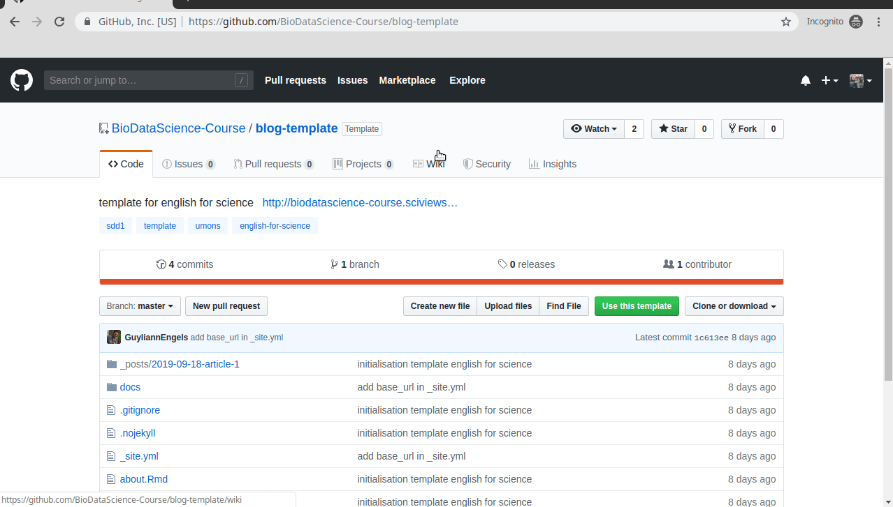
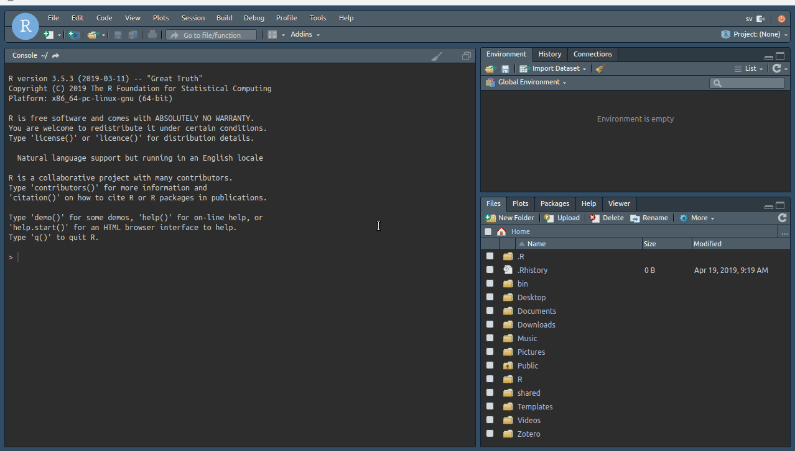
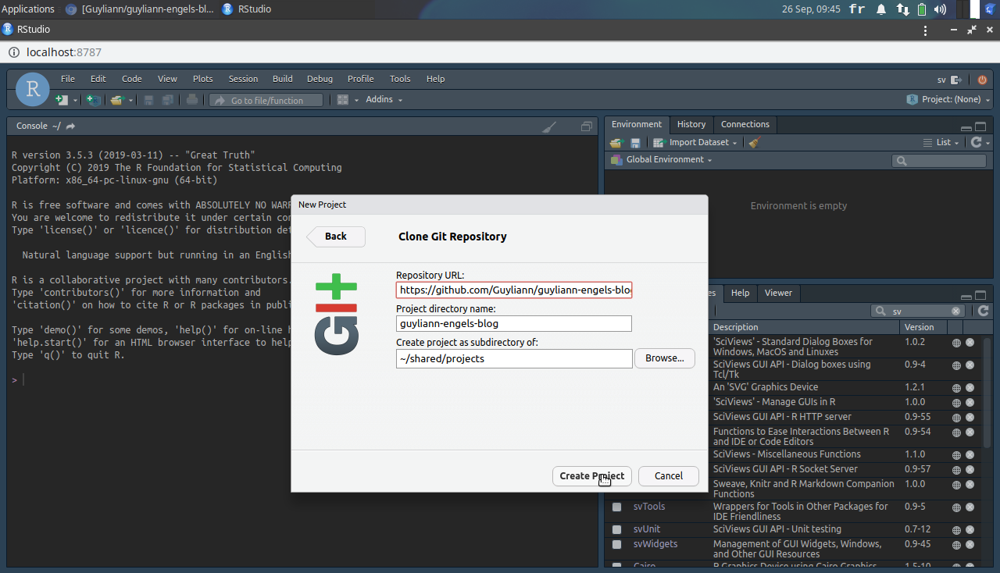
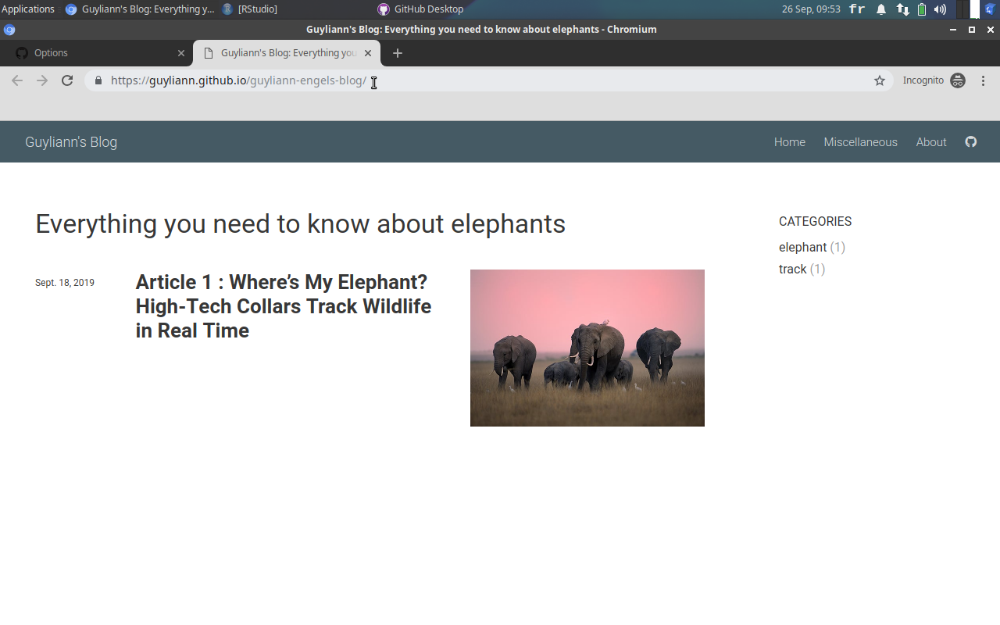

**Cet article est en cours d'édition de nouvelles images arrive très prochainement**

Un fichier [R Markdown](https://rmarkdown.rstudio.com/index.html) est un fichier avec une extension `.Rmd.`. Les documents R Markdown peuvent générer des multitudes de formats de sorties (html, pdf, doxcx, odt,...). Il est possible de réaliser des documents, des présentations, des sites web, des dashboards,... Dans le cadre de ce document, nous vous proposons de réaliser un blog scientifique avec le package distill de RStudio. Afin de vous simplifer cette tâche un [template](http://biodatascience-course.sciviews.org/blog-template/) est mis à votre disposition.

C'est maintenant à vous de jouer.

## Procédure

Vous allez réaliser votre premier **fork** et le cloner en local. Suivez les étapes suivantes :

Sur GitHub :

0. Connecter vous à GitHub si cela est nécessaire

1. Cliquer sur `Use this template`
2. Nommer votre dépots en respectant l'exemple (ex: guyliann/guyliann_blog)
3. Compléter la description en un phrase en anglais (ex:  my personal blog)
4. Cliquer sur `Create repository from template`

*Vous venez de créer votre repository*

5. Cliquer sur `code`
6. Cliquer sur le bouton pour copier l'URL (https)

Dans RStudio :

7. Cliquer sur `Project` puis `New Project...`, puis `Version Control`, puis `Git`
8. Copier votre URL du point 6 dans la section `Repository URL` (La section `Project directory name` se complète automatiquement sur base de l'URL copié.)
9. Cliquer sur `Browse...` de la section `Create project as subdirectory of`. Sélectionner le dossier `shared` puis `projects`

*Vous venez de créer votre dépôt local de votre blog personnel. Vous devez éditer plusieurs fichiers afin de rendre votre site accessible en ligne.*

Dans le fichier `_site.yml` de votre projet

11. Editer la ligner 2 `title`, nommez votre blog
12. Editer la ligne 13 `href`, remplacer l'url par l'url de votre blog sur github. (ex: https://github.com/Guyliann/guyliann_blog)
13. Editer la ligne 14 `base_url`, remplacer l'url par `profil github + .github.io/ + nom de votre dépot + /` (ex: guyliann.github.io/guyliann_blog/, que l'on peut traduire par `profil github + .github.io/ + nom de votre dépot + /`)

Dans le fichier `index.Rmd`

14. Editer la ligne 2 par le titre de votre blog.

Dans la section Build ( en haut à droite de votre IDE RStudio),

15. Cliquer sur `Build Website`

Dans la section `Git`

16. Réalisez un `Commit` et un `Push` de vos modifications.

Dans votre dépôt en ligne sur Github, 

17. Cliquer sur Settings 
18. Dans la section Github Pages, aller dans la section GitHub Pages, remplacer None par `Master` et `docs`

Au bout de quelques minutes votre site sera en ligne.

**N'hésite pas à ajouter un commentaire, si tu as des questions sur cet article.**
