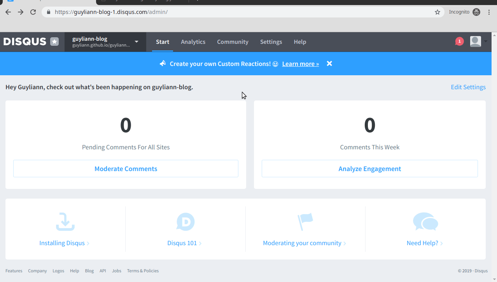

```{r setup, include=FALSE}
knitr::opts_chunk$set(echo = FALSE)
```

**Cet article est en cours d'édition**

Disqus est un service web qui permet de gérer des discussions sur des blogs. 

## Procédure

Pour ajouter disqus, vous devez suivre les instructions ci-dessous :

- Cliquez sur le lien suivant: <https://disqus.com> 

- Cliquez sur `Get Started` et créez vous un comptez sur disqus 

 


- Cliquez ensuite sur `I want to install Disqus on my site`

- Ajoutez le nom de votre website


- Dans les configuration de disqus, entrez l'adresse de votre blog

 

- Copiez le shortname de votre site qui se trouve dans la section `Edit Settings`.

 


- Dans le fichier _site.yml de votre projet ajoutez votre `shortname` comme présenté dans l'image suivante.


- Terminez par construire votre site, un `Commit` et un `Push`

 


**N'hésite pas à ajouter un commentaire, si tu as des questions sur cet article.**
