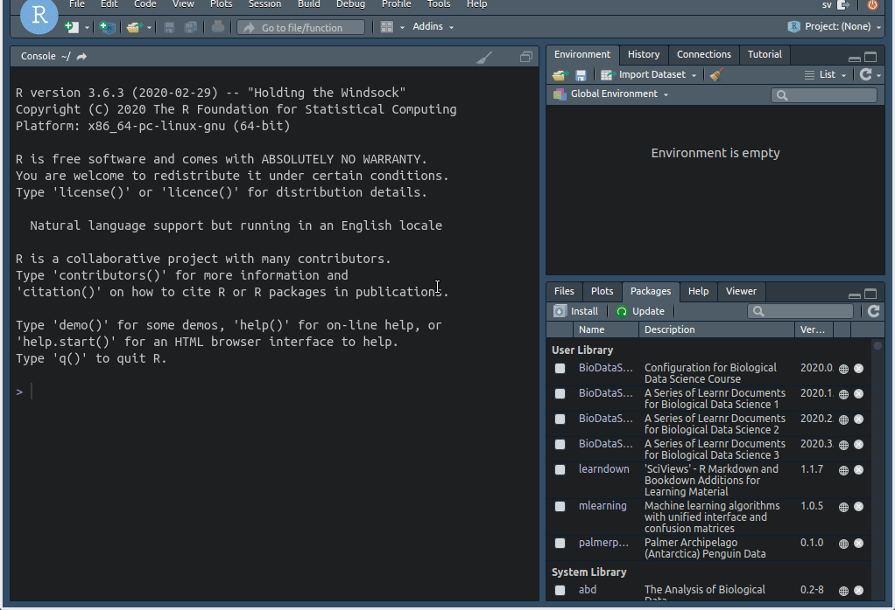
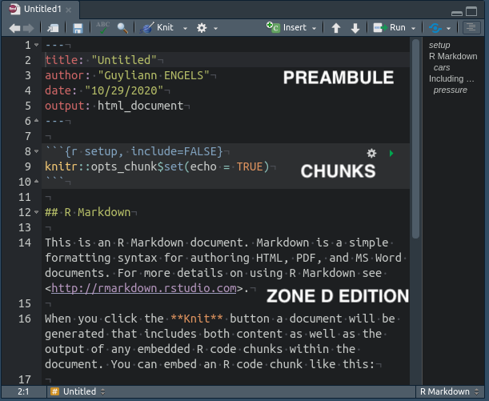
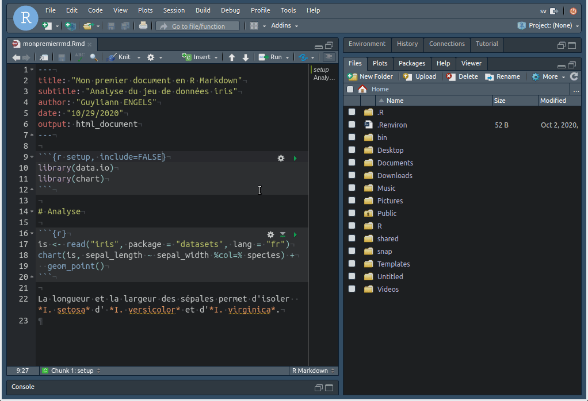
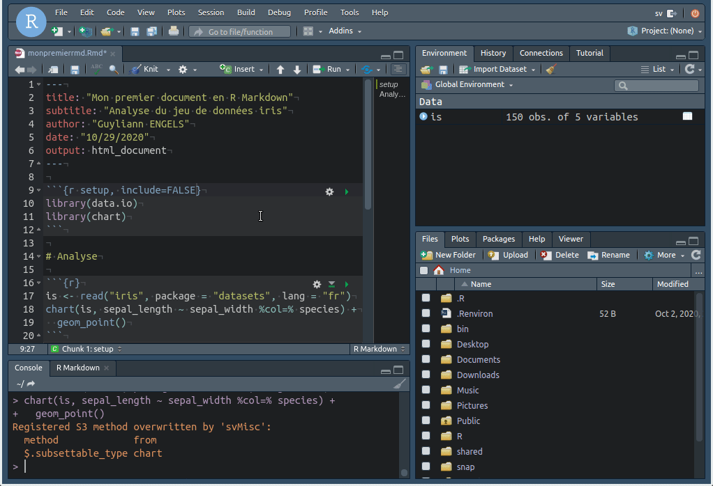

# R Markdown, c'est quoi !

...

# Création d'un premier document R Markdown

Il est très simple de créer un nouveau document dans RStudio.



# Structure d'un fichier R Markdown

Un fichier R Markdown se divise en 3 zones :

- le préambule en YAML
- les zones de codes : Chunks
- les zones d'édition en Markdown

Un même fichier Rmd peut contenir une succession de zones de codes et d'édition imbriqué.



## Préambule

Le préambule va permettre de donner quelques informations clés sur le document final. Il se situe au début du fichier. L'élément le plus important est le format de sortie (`ouput`). Il existe une multitude de format de sortie que nous allons explorer dans ce blog.

Soit particulièrement attentif à la structure de cette section. On observe un élément par ligne. On voit une entrée suivi de `:` puis un espace et la valeur souhaité.

```
author:"Guyliann Engels" # incorrect

author: "Guyliann Engels # correct
```

Pour en apprendre d'avantages,n'hésite pas à consulter l'article nommé [L’entête YAML](http://biodatascience-course.sciviews.org/sdd_blog/posts/2020-10-29-babayaml/)

## Zone d'édition

Les zones d'édition sont rédigés en Markdown. Le langage est très simple. Il nécessite d'apprendre quelques conventions qui sont résume en première page de ce document [R Markdown Reference Guide](https://rstudio.com/wp-content/uploads/2015/03/rmarkdown-reference.pdf)

**Cela fait maintenant plusieurs années que j'utilise ce langage et je ne me sens aucunement limité dans ma rédaction scientifique.**

## Zone de Code

Les instructions dans notre cas les instruction R doivent se trouver dans les chunks. On peut spécifier des options aux chunks. On retrouve un résumé de ces options en deuxième et troisième page de ce document de ce document [R Markdown Reference Guide](https://rstudio.com/wp-content/uploads/2015/03/rmarkdown-reference.pdf).

Pour exécuter le code à l'intérieur d'un chunk, on peut cliquer  



Il existe aussi le raccourci clavier : `ctrl + shift + enter` (ou bien sous Mac : `cmd + shift + enter`).

## Compilation du document

Pour compiler le fichier, il suffit enfin de cliquer sur le bouton `knit`. 



On peut très facilement changer le format de sortie en utilisant la fleche à coté du bouton `knit`


**Comme tu le vois c'est super simple **

***

**N'hésite pas à ajouter un commentaire, si tu as des questions sur cet article.**

***
