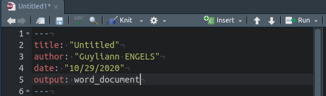

Rapellons-nous qu'on document R Markdown se divise en 3 zones :

- le préambule en YAML
- les zones de codes : Chunks
- les zones d'édition en Markdown

Nous allons nous attarder un peu plus en détails au préambule. Le préambule débute par trois tirets et se termine par trois tirets. C'est dans cette zone que tu vas spécifier des éléments importants comme le format de sortie, le titre, l'auteur,... 

## Le format de sortie

Un élément essentiel de l'entête YAML que tu dois rapidement détecter est le format de sortie (`output`). Ce format a un impact sur le rendu final de ton document. Il peut également influencer certains arguments que tu vas pouvoir ou non rentrer dans l'entête  YAML.

### Document pdf

L'image ci-dessous te montre un fichier R Markdown qui va être compilé par la suite en document pdf.

**Soit attentif, tu remarques que l'argument est suivi directement de `:` Il faut ensuite un espace puis l'information que tu associes à cet argument. **

Si c'est une chaîne de caractères relative à un titre, un nom d'auteur ou encore une date, il est conseillé de le placer entre guillemets.

## Document word

Voici identiquement le même fichier R Markdown qui va cette fois être compilé en document word.

### Document HTML

Et enfin, voici un troisième exemple du même fichier R Markdown qui va cette fois être compilé en document HTML avec quelques arguments supplémentaires.

On peut décoder la partie output de la manière suivante. Je veux un document compilé en HTML avec une table des matières (toc: yes), avec une figure à mes graphiques (fig_caption: yes) et avec des numéros de sections pour mes niveaux de titres (number_sections: yes).

**Soyez très vigilants à l'indentation des instructions.**

# A retenir

L'entête YAML est la zone que tu ne dois pas négliger lorsque tu rédige un fichier en R Markdwon. Cette entête respecte des conventions **strictes** que tu dois impérativement respecter. Une erreur dans le préambule et ton fichier risque de ne pas compiler.

***

Tu souhaite en apprendre d'avantages, consulte les autres articles sur le sujet.

**N'hésite pas à ajouter un commentaire, si tu as des questions sur cet article.**

***
