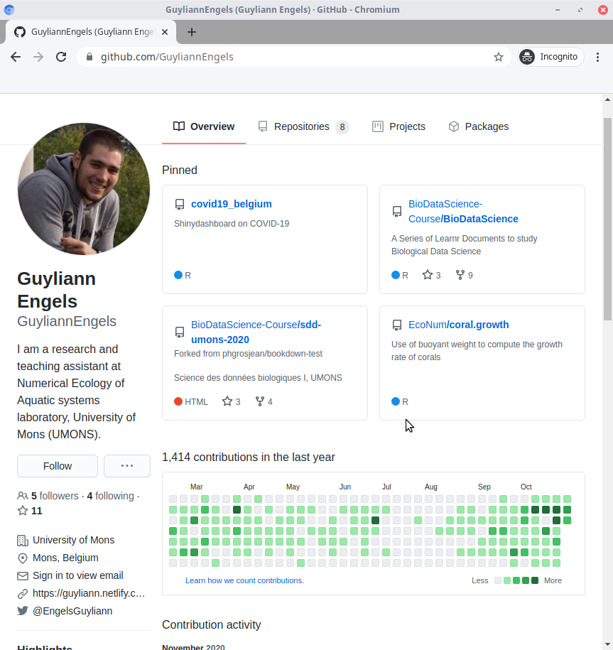
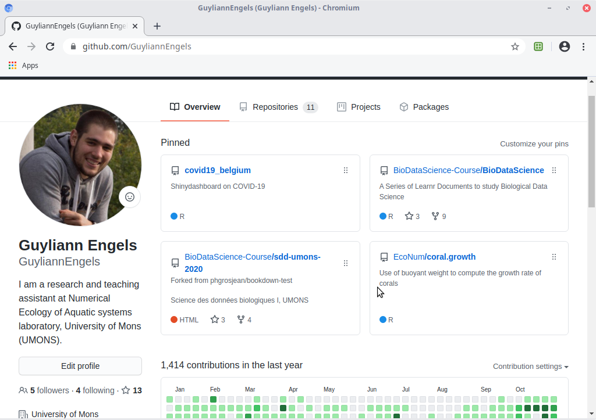
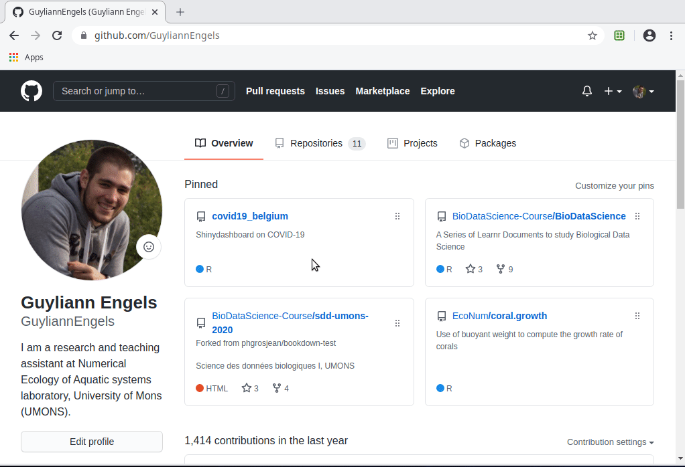

Ton compte GitHub est un véritable outil que tu peux utiliser pour montrer tes capacités à un futur employeur. En effet, tous tes dépôts publics sont visibles par tout le monde.

Sur un C.V., tu peux volontairement ou non exagérer certaines de tes compétences. Avec GitHub, tu ne peux pas vraiment tricher. On peut voir ce que tu es capable de faire. 

Un profil Github personnalisé est tout simplement une jolie vitrine de tes compétences.

A gauche, tu peux proposer quelques informations sur toi comme une biographie, ton email, ton compte Twitter,...

Au centre, tu peux mettre en avant jusqu'à 6 dépôts dans la section `Pinned`. Cela permet de montrer les projets dont tu es le plus fier.

En bas de l'image, on peut observer tes contributions. Ces contributions correspondent au *push* que tu réalises sur tes différents projets. Des contributions régulières montrent que tu sais utiliser les outils de gestion de version. 

**C'est maintenant à toi de jouer !**

Pour éditer ton profil, il te suffit de cliquer sur le bouton `Edit profile`. Pour sélectionner tes dépôts préférés, il faut cliquer sur `Customize your pins`.

Tu peux également personnaliser ton profil en te rendant directement dans les paramètres de ton compte.

***

**N'hésite pas à ajouter en commentaire le lien de ton profil**

***
